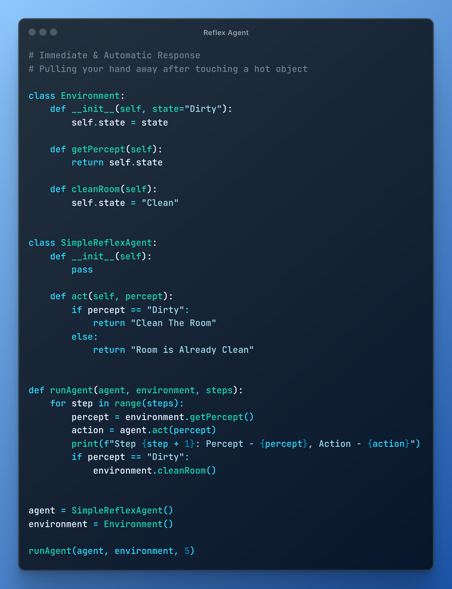
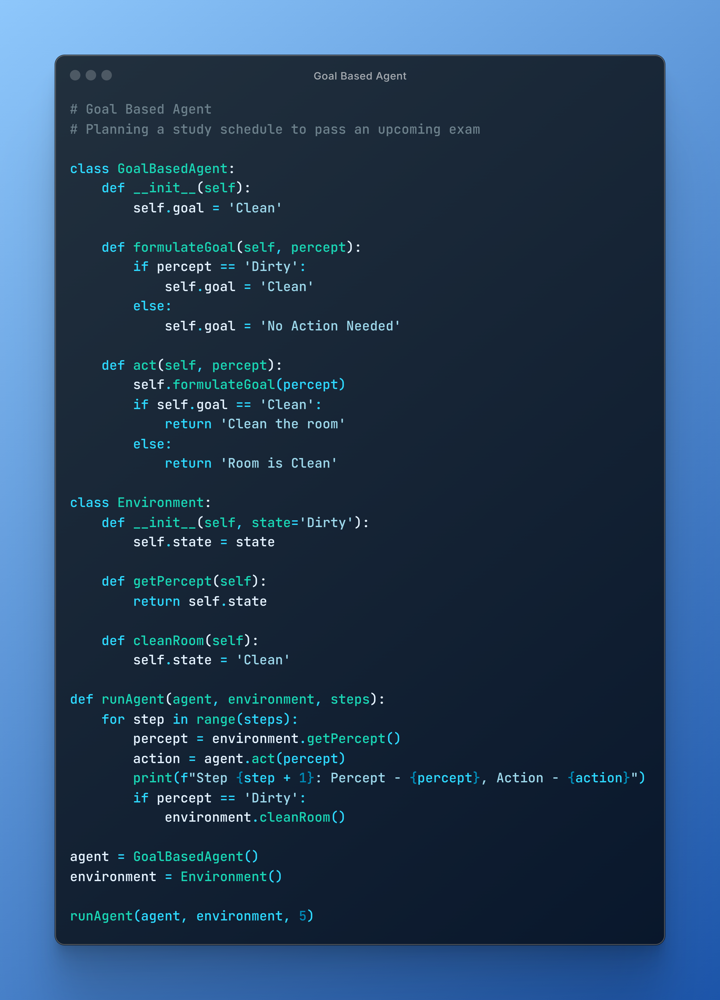
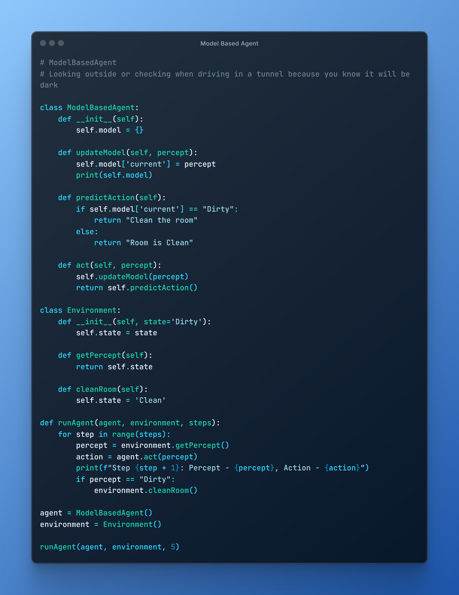
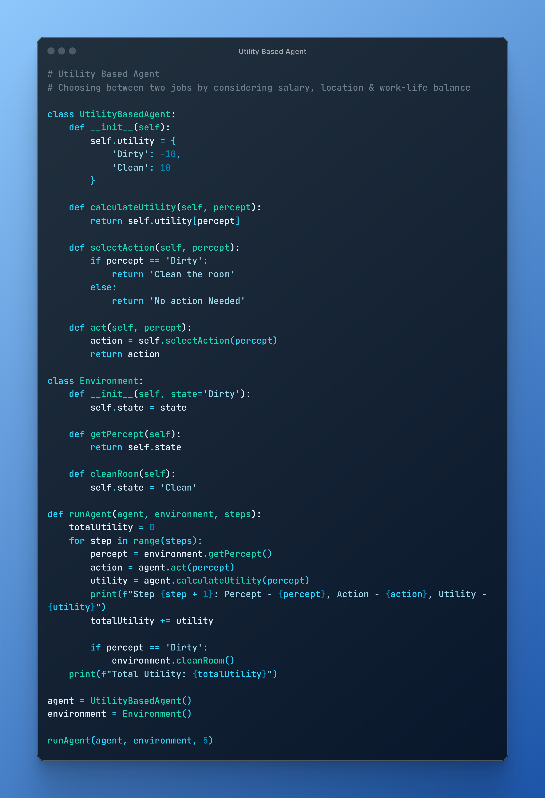
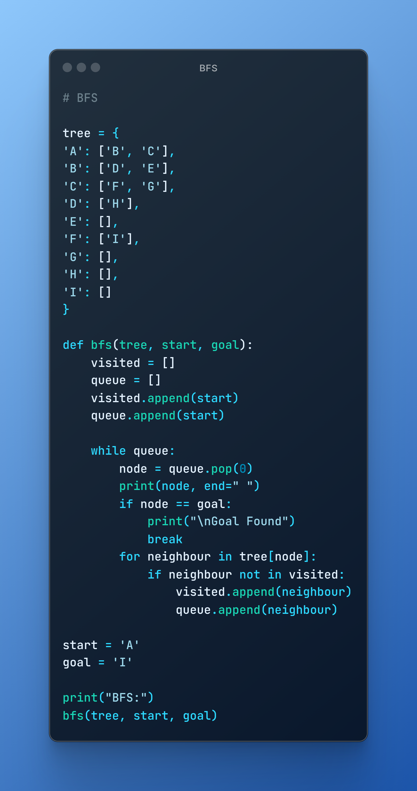
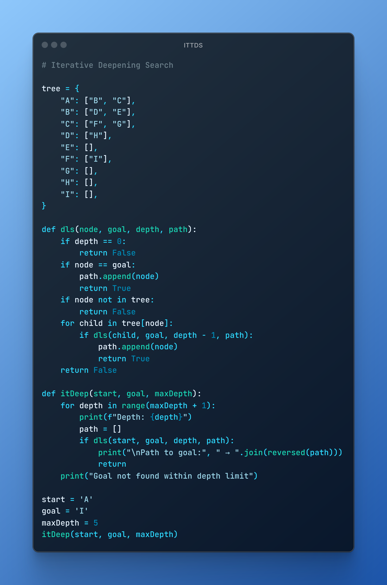
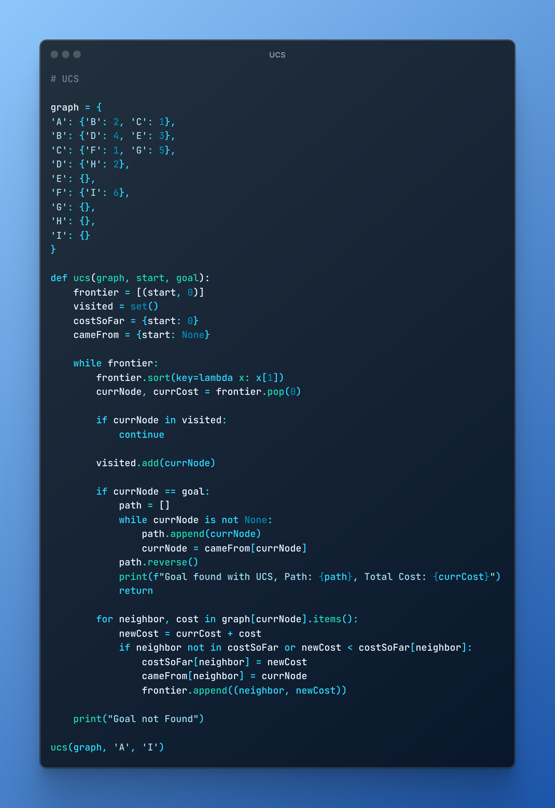

<h1 align="center">
 
AI-LAB
</h1>

  <figure>
    
    <figcaption>Reflex-Agent</figcaption>
  </figure>
  <figure>
    
    <figcaption>Goal-Based-Agent</figcaption>
  </figure>
  <figure>
    
    <figcaption>Model-Based-Agent</figcaption>
  </figure>
  <figure>
    
    <figcaption>Utility-Based-Agent</figcaption>
  </figure>
  <figure>
    
    <figcaption>Learning-Based-Agent</figcaption>
  </figure>
  <figure>
    
    <figcaption>BFS</figcaption>
  </figure>
  <figure>
    
    <figcaption>DFS</figcaption>
  </figure>
  <figure>
    
    <figcaption>DLS</figcaption>
  </figure>
  <figure>
    
    <figcaption>ITTDS</figcaption>
  </figure>
  <figure>
    
    <figcaption>UCS</figcaption>
  </figure>

